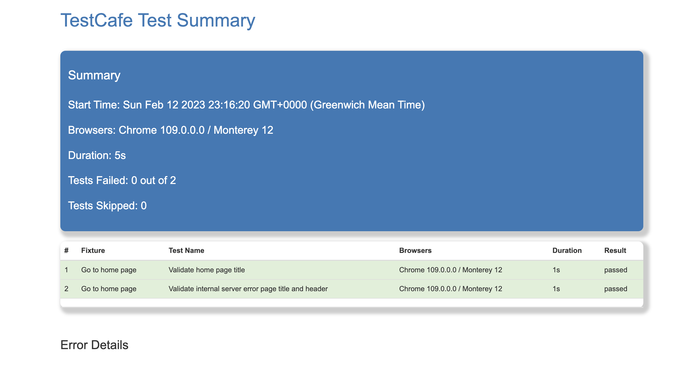

## Sky Ui Tests Testcafe Example

Example test cases written in Testcafe, that:

- use a page object pattern
- use async/await
- run in parallel
- run on multiple browsers
- run headlessly

## Setup
1. clone https://github.com/ferhataltinisik/sky-ui-test.git
2. install TestCafe Runner extension
3. install `npm i`
4. Set your environment on Cli

    * `export TESTCAFE_ENV=prod`
    * `export TESTCAFE_ENV=test`  
    * `export TESTCAFE_ENV=dev` 

## Run
* run npm test to watch in browser, or
* npm run all to run parallel, headless, on Chrome and Firefox or
* npm run browserstack to run tests in the cloud (requires an account and env keys to be set)
* npm run to see more options

## Report
* use `npm run test:reports` to run all tests and create html report
* to see html report go reports/htmlReports file

